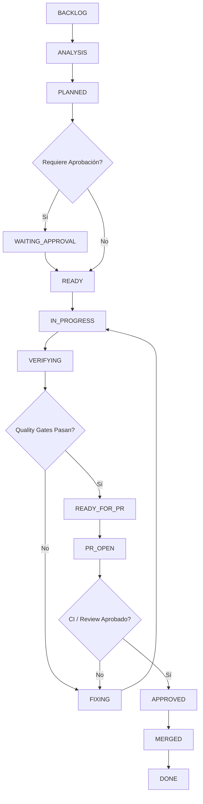

# 🤖 Agente Dev - Autonomous Software Delivery Workflow & CLI

> **Orquestador de Entrega Continua y Flujo de Trabajo Autónomo para Agentes de Desarrollo de Software.**

Este proyecto implementa un marco metodológico y una herramienta de línea de comandos (**CLI**) para gobernar el ciclo de vida completo de tareas y funcionalidades (desde la especificación técnica hasta la validación y el reporte final). Garantiza trazabilidad, calidad (*Quality Gates*), desarrollo guiado por pruebas (*TDD*), creación automática de ramas en Git y auto-corrección (*Self-Healing*).

---

## 📑 Tabla de Contenidos

- [Requisitos Previos](#-requisitos-previos)
- [Instalación](#-instalación)
- [Guía de Uso de la CLI (`agt`)](#-guía-de-uso-de-la-cli-agt)
- [Estructura del Proyecto](#-estructura-del-proyecto)
- [Ciclo de Vida y Máquina de Estados](#-ciclo-de-vida-y-máquina-de-estados)
- [Quality Gates y Verificación](#-quality-gates-y-verificación)
- [Pruebas Unitarias](#-pruebas-unitarias)

---

## ⚙️ Requisitos Previos

- **Node.js**: `>= 18.0.0` (recomendado v20+ o v22+)
- **pnpm**: `>= 9.0.0` (gestor de paquetes oficial del proyecto)
- **Git**: `>= 2.30.0`

---

## 📦 Instalación

### 1. Clonar el Repositorio
```bash
git clone <URL_DEL_REPOSITORIO>
cd agente_dev
```

### 2. Instalar Dependencias con `pnpm`
```bash
pnpm install
```

Si `pnpm` solicita aprobación de scripts de compilación para dependencias nativas:
```bash
pnpm approve-builds --all
```

### 3. Enlazar la CLI Globalmente
Para poder ejecutar el comando `agt` o `agente-dev` desde cualquier terminal del sistema:

```bash
npm link
```
*(o alternativamente: `pnpm link --global`)*

Verifica la instalación ejecutando:
```bash
agt --help
```

---

## 🛠️ Guía de Uso de la CLI (`agt`)

El CLI del agente automatiza el flujo de trabajo de desarrollo y la gestión de ramas de Git.

### 1. Crear una nueva tarea y su rama de Git
Genera los 4 artefactos en `docs/workflow/` (`tasks/`, `specs/`, `plans/`, `tests/`) y **crea/conmuta automáticamente a la nueva rama de Git** con formato estandarizado (`<tipo>/<ID>-<slug>`):

```bash
# Ejemplo: Tarea de tipo feature
agt task:new AGT-0002 -t "Implementar nuevo validador de esquemas" --type feat

# Ejemplo: Tarea de tipo fix (corrección)
agt task:new AGT-0003 -t "Corregir manejo de rutas en Windows" --type fix
```

**Opciones disponibles para `task:new`:**
- `-t, --title <texto>` *(Obligatorio)*: Título descriptivo de la tarea.
- `--type <tipo>` *(Opcional)*: Tipo de tarea (`feat`, `fix`, `refactor`, `docs`, `test`, `chore`). Por defecto: `feat`.
- `--owner <nombre>` *(Opcional)*: Responsable o equipo asignado. Por defecto: `team-agent`.
- `--base <rama>` *(Opcional)*: Rama base de origen. Por defecto: `main`.
- `--no-branch` *(Opcional)*: Genera los archivos sin crear ni conmutar a una nueva rama de Git.

---

### 2. Conmutar a la rama de una tarea existente
Calcula el nombre de la rama a partir del manifiesto de la tarea y cambia a ella (creándola si no existía localmente):

```bash
agt task:branch AGT-0001
```

---

### 3. Verificar Quality Gates de una tarea
Valida la estructura del manifiesto YAML y ejecuta automáticamente los comandos de prueba, lint o build configurados:

```bash
agt task:verify AGT-0001
```

---

### 4. Ejecutar el Bucle Autónomo de Auto-Corrección (Self-Healing Loop)
Ejecuta el ciclo cerrado completo: evalúa quality gates, diagnostica causas de fallos si los hay, reintenta hasta el límite configurado y genera automáticamente el reporte final en `docs/workflow/executions/<ID>.md`:

```bash
# Ejecutar bucle con 3 reintentos por defecto
agt task:loop AGT-0003

# O con alias y límite personalizado
agt task:run AGT-0003 --max-retries 5
```

---

### 5. Listar todas las tareas del workflow
Muestra el listado de todas las tareas registradas en el proyecto y su estado actual:

```bash
agt task:list
```

---

### 6. Consultar o actualizar el estado de una tarea
```bash
# Consultar estado actual
agt task:status AGT-0001

# Actualizar estado a IN_PROGRESS, READY_FOR_PR, DONE, etc.
agt task:status AGT-0001 IN_PROGRESS
agt task:status AGT-0001 DONE
```

---

## 📂 Estructura del Proyecto

```text
agente_dev/
├── .agents/
│   ├── rules/
│   │   └── master-workflow.md     # Regla maestra del flujo (Director Técnico)
│   └── skills/                    # Habilidades especializadas del agente
├── bin/
│   └── agente-dev.js              # Punto de entrada ejecutable de la CLI (agt)
├── docs/
│   └── workflow/                  # Artefactos generados por cada tarea
│       ├── tasks/                 # Manifiestos YAML de tareas (<ID>.yml)
│       ├── specs/                 # Especificaciones técnicas (<ID>.md)
│       ├── plans/                 # Planes de implementación (<ID>.md)
│       ├── tests/                 # Matrices y planes de prueba (<ID>.md)
│       ├── features/              # Especificaciones BDD en Gherkin (<ID>.feature)
│       └── executions/            # Reportes finales de ejecución (<ID>.md)
├── features/                      # Especificaciones BDD globales del sistema
├── src/                           # Código fuente del motor del agente
│   ├── git.js                     # Integración con Git y cálculo de ramas
│   ├── task-manager.js            # Gestor de tareas y plantillas
│   ├── validator.js               # Validador de manifiestos y Quality Gates
│   └── index.js                   # Exportaciones de la librería
├── templates/                     # Plantillas estándar para tareas y documentos
│   └── feature.feature            # Plantilla universal Gherkin con comentarios en español
├── tests/                         # Suite de pruebas unitarias (Vitest) y BDD (Cucumber)
│   └── bdd/steps/                 # Step Definitions en JavaScript para Cucumber
├── cucumber.json                  # Configuración centralizada de Cucumber.js
├── package.json                   # Configuración del paquete y scripts
└── README.md                      # Documentación principal del sistema
```

---

## 🔄 Ciclo de Vida y Máquina de Estados

Toda tarea procesada por el agente sigue una progresión estricta:



---

## 🛡️ Quality Gates y Verificación

Cada tarea contiene un archivo de manifiesto YAML (`docs/workflow/tasks/<ID>.yml`) donde se especifican los gates obligatorios:

```yaml
id: AGT-0002
title: "Integracion de Motor BDD con Gherkin y Cucumber"
type: feat
status: READY_FOR_PR
quality_gates:
  unit_tests: true
  bdd_tests: true
  smoke_tests: true
commands:
  install: "pnpm install"
  unit_tests: "pnpm test"
  bdd_tests: "pnpm test:bdd"
  smoke_tests: "node ./bin/agente-dev.js --help"
```

El comando `agt task:verify <ID>` se asegura de que:
1. El manifiesto cumpla con todos los campos obligatorios.
2. Cada gate activo (`true`) tenga un comando asociado en `commands`.
3. Todos los comandos retornen código de salida `0` (éxito).

---

## 🧪 Pruebas Unitarias y BDD (Gherkin)

El proyecto cuenta con un doble motor de validación automatizada:

### 1. Pruebas Unitarias con Vitest
```bash
# Ejecutar todas las pruebas unitarias
pnpm test

# Modo observador (watch)
pnpm run test:watch
```

### 2. Pruebas de Comportamiento BDD con Cucumber y Gherkin
```bash
# Ejecutar la suite de especificaciones BDD (.feature)
pnpm test:bdd
```

---

## 💡 Principio de Aprendizaje y Código Limpio

Todo el código fuente en `src/`, `bin/`, `tests/` y las plantillas `.feature` está exhaustivamente **comentado en español línea por línea**, permitiendo entender en detalle cómo funciona cada algoritmo, comando de Git, step definition de Cucumber y validación de esquemas.
